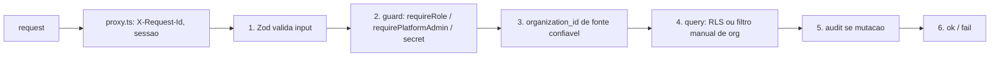

# Repository Guidelines

> **escreve.ai:** este repositório é uma edição independente. As branches, os remotes, a distribuição e a origem dos guias herdados estão definidos em [Identidade e operação](docs/escreve-ai.md); essa orientação prevalece para esta edição.

> Contrato portável para **qualquer** agente de código (Codex, Cursor, OpenCode, Antigravity, Copilot).
> Este arquivo é o núcleo. A **doutrina completa e não-negociável vive em [`CLAUDE.md`](CLAUDE.md)** —
> leia-o antes de tocar em código. O mapa de toda a documentação está em [`docs/index.md`](docs/index.md).
> Precedência quando dois documentos discordam: `CLAUDE.md` > `docs/specs/` > `docs/prd/` >
> `HANDOFF-*.md` > `README.md`.

## Project Overview

Sistema operacional de vendas open source com agentes de IA nativos, multi-nicho (e-commerce,
clínicas, imobiliárias, infoprodutos, serviços), WhatsApp como canal primário via WAHA, CRM
inteiro exposto por MCP. Multi-tenant com RLS desde o dia 1; LGPD nativa. Monetização =
**self-host em VPS**, não assinatura. Posicionamento: [`VISION.md`](VISION.md); estado real de
implementação: [`docs/current-state.md`](docs/current-state.md).

**Consequência que muda como você trabalha:** o produto é distribuído como código. Quem instala
numa VPS **é** o usuário. Uma mudança que funciona na máquina do dev e quebra no clone fresco é
**bug de produto**, não detalhe de ambiente. Nada que exija edição manual de arquivo na VPS entra.

Stack canônica (major; a versão exata é o `package.json`):

Next.js 16 (App Router, Turbopack) · React 19 · TypeScript 6 estrito · Tailwind 4 (config em CSS) ·
shadcn/ui (`new-york`) · Supabase (Postgres + Auth + Realtime + Storage) · Zod 4 · Vitest 4 ·
Playwright 1 · Sentry 10 · WAHA 2026.7.2 (engine NOWEB) · Upstash Redis · Vercel AI Gateway
(`@ai-sdk/anthropic|openai|google`).

> As majors acima são verificadas contra o `package.json` por
> [`tests/unit/agents-md-versoes.test.ts`](tests/unit/agents-md-versoes.test.ts) — declare **só a
> major**; afirmar minor em prosa cria débito que nenhum gate cobre e trava bump do Dependabot.
> Um teste irmão,
> [`tests/unit/documentacao-aponta-para-o-que-existe.test.ts`](tests/unit/documentacao-aponta-para-o-que-existe.test.ts),
> reprova todo path citado aqui que não exista no disco.

## Architecture & Data Flow

- **App** — Next.js 16 App Router: UI + Route Handlers no mesmo repo. Server Components por
  default; `"use client"` só com estado/evento/API de browser. Middleware de borda em `proxy.ts`
  (Next 16 renomeou `middleware.ts` → `proxy.ts`; ele injeta `X-Request-Id` e `x-pathname` e
  autentica a sessão antes da rota).
- **DB** — Supabase Postgres. RLS em toda tabela tenant-aware via helper
  (`fn_user_org_ids()`/`fn_user_role_in_org()`), a mesma função SECURITY DEFINER que o RBAC de
  aplicação usa. Schema versionado em `supabase/migrations/`; o que o self-host aplica é
  `supabase/baseline.sql`.
- **Auth** — Supabase Auth + `@supabase/ssr`, cookie `SameSite=Strict`. Sempre `getUser()` no
  server; **nunca** `getSession()`. MFA TOTP é opcional e ligado por quem administra
  (duas políticas que somam: plataforma e organização), regra pura em
  `lib/auth/politica-mfa.ts`.
- **Filas** — event sourcing leve: `event_log` + workers drenados por cron. Trigger Postgres
  **nunca** faz HTTP.
- **IA** — Vercel AI Gateway (Anthropic primário, OpenAI para embeddings), RAG por tenant,
  guardrails before-send.
- **Tempo real** — Supabase Realtime (`postgres_changes` para inbox/kanban, `broadcast` para
  sinais leves). **Storage** — bucket privado `whatsapp-media`, URL assinada.

Fluxo de uma rota autenticada de tenant:



Superfícies **não-cookie** (cada uma com guard próprio, nunca o cookie de sessão):
`app/api/v1/cron/` (Bearer `INTERNAL_CRON_SECRET`, fail-closed), `app/api/internal/`
(`x-internal-secret`), `app/api/mcp/` (Bearer `dsk_...` contra `api_tokens`), `app/api/v1/webhooks/`
(HMAC + path token), e **parte de `app/api/v1/`** — rotas que aceitam cookie OU bearer pelo helper
`lib/api/auth-dual.ts`. Esta última cresce rota por rota (decisão do dono em 17/09/2026: converter
o que cada integração precisar), então o inventário é um comando e não uma lista:
`git grep -ln "auth-dual" -- app/api/v1`. Rota com o helper **também** precisa de entrada em
`lib/auth/public-paths.ts`, senão o `proxy.ts` devolve 401 antes do handler. Inventário e superfície de ataque: [`docs/threat-model.md`](docs/threat-model.md).

Turno do agente de IA: inbound WhatsApp → HMAC + idempotência → `event_log` → worker →
`runAgentTurn` (RAG + tools MCP) → guardrails → adapter WAHA → handoff humano se o gatilho
disparar. Entrada do turno em `lib/agent-engine/agent/inbound-turn.ts`; diagrama em
`docs/architecture/agent-turn.html`.

| Path | O quê |
|---|---|
| `app/api/v1/` | Route handlers REST (versionado por path) — **reconte, não cite**: `git ls-files 'app/api/v1/**/route.ts' \| wc -l` (e `git ls-files 'app/api/**/route.ts' \| wc -l` para o total de `app/api/**`) |
| `app/api/internal/`, `app/api/mcp/`, `app/api/v1/cron/` | superfícies não-cookie (secret/bearer próprio) |
| `app/app/` | UI autenticada do tenant · `app/admin/` UI de plataforma |
| `app/actions/` | Server Actions (auth, onboarding, team, settings) |
| `lib/agent-engine/`, `lib/ai/` | runtime do agente, guardrails, RAG, dispatcher |
| `lib/api/wrappers.ts` | `ok()` / `fail()` — **use sempre**, não monte Response na mão |
| `lib/auth/require-role.ts` | `requireRole()` — guard canônico de RBAC |
| `lib/supabase/{browser,server,admin}.ts` | clients canônicos |
| `workers/` | workers de `event_log` + crons |
| `supabase/migrations/` | schema versionado · `supabase/baseline.sql` = o que o self-host aplica |
| `proxy.ts` | middleware do Next 16 (auth de borda, `X-Request-Id`) |
Idempotência de worker: `unique (organization_id, external_id)` + captura de `code === '23505'`.
Contrato completo em [`docs/specs/07-spec-events-workers.md`](docs/specs/07-spec-events-workers.md).

## Key Directories

| Path                    | O quê                                                                                                           |
| ----------------------- | --------------------------------------------------------------------------------------------------------------- |
| `app/api/`              | Route handlers REST, versionados por path. Conte quantos existem: `git ls-files 'app/api/**/route.ts' \| wc -l` |
| `app/app/`              | UI autenticada do tenant                                                                                        |
| `app/admin/`            | UI de plataforma (platform admin)                                                                               |
| `app/actions/`          | Server Actions (auth, onboarding, team, settings)                                                               |
| `lib/agent-engine/`     | Runtime do agente: turno inbound/outbound, playbooks, handoff, follow-up, memória da org                        |
| `lib/ai/`               | Modelos, custo, orçamento, RAG, dispatcher, catálogo de providers                                               |
| `lib/channels/`         | Abstração de canal (invariante de restrição de canal)                                                           |
| `lib/api/`              | `wrappers.ts` (`ok()`/`fail()`) e `errors.ts` (catálogo de códigos)                                             |
| `lib/auth/`             | `server.ts` (sessão/org), `require-role.ts` (`requireRole`), `public-paths.ts` (borda)                          |
| `lib/supabase/`         | Clients canônicos: `browser.ts`, `server.ts`, `admin.ts` (service role)                                         |
| `lib/branding/`         | Marca própria (white-label) — resolve do banco, nunca do .env                                                   |
| `workers/`              | Workers de `event_log` + crons                                                                                  |
| `components/`, `hooks/` | React compartilhado; convenções nos README de cada pasta                                                        |
| `supabase/migrations/`  | Schema versionado + `MANIFEST.md`; `supabase/baseline.sql` é o que o self-host aplica                           |
| `hostgator-setup-kit/`  | Kit de instalação/atualização da VPS (`install.sh`, `update.sh`, `diagnostico.sh`, `healthcheck.sh`)            |
| `scripts/`              | CLIs de operação e QA — ver `scripts/README.md`                                                                 |
| `tests/`                | `unit/`, `invariants/`, `e2e/`, `shell/`, `journeys/`, `fixtures/`                                              |
| `docs/`                 | Doutrina, PRDs, specs, regras de negócio, runbooks, design system — entrada em `docs/index.md`                  |
| `.agents/skills/`       | Guias do assistente embutidos (espelho em `.claude/skills/`, regerado por `pnpm skills:sync`)                   |

## Development Commands

```bash
pnpm install          # deps (frozen-lockfile no CI)
pnpm dev              # dev server
pnpm build            # next build
pnpm lint             # eslint
pnpm typecheck        # tsc --noEmit -p tsconfig.typecheck.json (inclui tests/)
pnpm test:unit        # vitest — EXCLUI tests/invariants, tests/e2e e tests/journeys (lista viva em vitest.config.ts → exclude)
pnpm test:db          # invariantes de banco + gate do baseline (PRECISA de Docker)
pnpm test:e2e         # Playwright (PRECISA de app rodando + banco semeado)
pnpm gov:verify       # typecheck + lint + lint:channels + lint:role-rank + test:unit
                      # ← verificação única atual; o encadeamento real sai de:
                      #   node -e "console.log(require('./package.json').scripts['gov:verify'])"
pnpm lint             # eslint (flat config)
pnpm typecheck        # tsc --noEmit -p tsconfig.typecheck.json
pnpm test:unit        # vitest run — EXCLUI tests/e2e, tests/invariants, tests/journeys
pnpm test:db          # invariantes de banco + gate do baseline (PRECISA de Docker)
pnpm test:e2e         # Playwright (PRECISA de app buildado + .env.e2e)
pnpm test:shell       # scripts do kit self-host (bash)
pnpm gov:verify       # typecheck + lint + lint:channels + lint:role-rank + test:unit
```

⚠️ **`pnpm gov:verify` não cobre tudo.** Ele omite `test:db`, `test:e2e` **e** `test:shell`.
Se a mudança toca schema/RLS/tabela tenant-aware, rode `pnpm test:db`. Se toca UI ou fluxo de
usuário, rode `pnpm test:e2e` com evidência visual. Se toca `Dockerfile*`, `docker-compose*` ou
`hostgator-setup-kit/`, rode `pnpm test:shell` — é o único gate que exercita o kit.

**O que o CI cobre.** `.github/workflows/ci.yml`: `verify` = os passos do job, na ordem —
typecheck, lint, `lint:channels`, `test:unit` e `test:shell` hoje, e `pnpm lint` sozinho **não**
cobre os dois últimos (liste em vez de acreditar nesta linha:
`awk '/^  verify:/,/^  invariants-majors:/' .github/workflows/ci.yml | grep -A1 'name:'`);
`invariants` = fachada sobre a matriz `invariants-majors`, que roda `pnpm test:db` (isolamento
RLS + invariantes de governança) e `pnpm test:db:update` (atualizar banco COM dados) uma vez por
major de Postgres suportado. `.github/workflows/perf.yml`: `build-and-size` = `pnpm build`.
`.github/workflows/e2e.yml` roda as specs Playwright contra um Supabase local de verdade com
o `baseline.sql` aplicado — o mesmo banco que o self-hoster tem. **É check obrigatório** — a
data de ativação não é auditável pelo repositório, e a lista viva está logo abaixo, com o
comando ao lado. **Não há número aqui de propósito**: esta linha já afirmou uma contagem exata
de specs e "a única de fora", e as duas envelheceram — a suíte cresce toda semana e a lista de
exceções muda com ela. Quem fica de fora é o que a própria variável declara; leia, não confie:
O CI tem cinco checks obrigatórios na `main`: `verify`, `build-and-size`, `invariants`, `e2e`,
`imagens-ok`. Não confie nesta lista — reconte antes de citar:

```bash
gh api repos/melgarafael/DeskcommCRM/branches/main/protection \
  --jq '.required_status_checks.contexts|join(", ")'
```

`e2e` roda as partes da sua matrix em paralelo (quantas:
`git show origin/main:.github/workflows/e2e.yml | grep -E '^ +parte: \['` — esta linha dizia
"três" até o PR #983 acrescentar a quarta); as specs de fora estão declaradas, **com motivo
escrito**, em `FORA_DO_CI` dentro de `.github/workflows/e2e.yml`. Leia em vez de supor:

```bash
git show origin/main:.github/workflows/e2e.yml | grep -A4 'FORA_DO_CI:'
```

## Embedded Assistant Guides

O repositório embute guias em `.agents/skills/` (lidos por Codex, Cursor, OpenCode, Antigravity;
o Claude Code lê o espelho em `.claude/skills/`). Carregue o guia quando o pedido casar, mesmo que
a pessoa não saiba que ele existe — `tests/unit/skills-embutidas.test.ts` exige que este arquivo
cite cada um:

**Os cinco são checks obrigatórios** na branch protection da `main` — medido em 2026-08-14 @ `741c4ec8` (o comando exige permissão de **admin** no repositório: com token de contribuidor ele devolve `404`, medido em 2026-09-13):
| Situação                                                                            | Guia                    |
| ----------------------------------------------------------------------------------- | ----------------------- |
| Instalar, atualizar ou consertar a instalação numa VPS; domínio, Supabase, WhatsApp | `deskcomm-instalar`     |
| Configurar o CRM para um cliente ou nicho: agentes, roteadores, follow-ups, base    | `deskcomm-cliente-novo` |
| Desempenho, conversão, custo de IA, funil, relatório                                | `deskcomm-metricas`     |
| O agente responde errado, passa tudo para humano, não usa a agenda; afinar o prompt | `deskcomm-prompt`       |
| Contribuir: corrigir bug, abrir ou atualizar PR, migration, conflito com a `main`   | `deskcomm-contribuir`   |
| Criar extensão/plugin/módulo de nicho, ou transformar um PR de nicho em pacote      | `deskcomm-extensao`     |
| Escrever ou revisar código aqui                                                     | `deskcomm-doutrina`     |

O gate de arquitetura de qualquer peça que atende pessoas é a skill `sistema-vivo` (lei em
[`docs/doctrine/sistema-vivo.md`](docs/doctrine/sistema-vivo.md)).

## Code Conventions & Common Patterns

**Receita de route handler** — nesta ordem, sem atalho:

1. Zod valida **todo** input externo (body, query, path).
2. Guard canônico: `requireRole()` de `lib/auth/require-role.ts`,
   `requirePlatformAdmin`, ou secret/HMAC. Nunca reimplemente a comparação de rank na mão.
   Handler **mutante** de `app/api/v1` declara ainda `requireSupportWrite(` (`lib/impersonate/support.ts`)
   antes do efeito: barra escrita em `support_readonly` e não substitui RBAC/MFA.
3. `organization_id` resolvido de **fonte confiável** (cookie/JWT/webhook secret/path token) —
   **nunca do body**.
4. Query: RLS pelo client de sessão, ou filtro manual de `organization_id` quando usa service role.
5. `audit()` (fire-and-forget) se houve mutação.
6. Responda com `ok()` / `fail()` de `lib/api/wrappers.ts` — nunca monte `Response` na mão.

```ts
const authz = await requireRole("manager", { requestId });
if (!authz.ok) return authz.response;
```

**Erros** — `fail(code, message, status)` com código de `lib/api/errors.ts`. Nunca `throw` cru na
borda. Cada response leva `X-Request-Id`, correlacionado com o audit log.

**Nomes e dados** — arquivos e símbolos em PT-BR são a norma (mantenha o idioma do arquivo que
editar). JSON da API em **snake_case**; dinheiro em `_cents` + `currency`; datas ISO-8601 UTC;
UUID v4. Testes ao lado do código (`lib/foo/bar.test.ts`) ou em `tests/`.

**Log** — `lib/logger.ts` (estruturado, JSON). `console.log` é proibido em código merged —
`no-console` é `warn` no ESLint e o DoD cobre o resto. Nunca logue segredo, token, CPF, telefone
ou e-mail; o `beforeSend` do Sentry higieniza, mas não é a única camada.

**Multi-tenancy** — `organization_id uuid not null references organizations(id) on delete cascade`
em toda tabela tenant-aware. `lib/supabase/admin.ts` **bypassa RLS**: toda query com service role
filtra `organization_id` manualmente. Sem gate automático para isso — a responsabilidade é sua.

**Migrations** — mudança de schema sai **sempre** como tripla: migration versionada em
`supabase/migrations/`, apêndice idempotente em `supabase/baseline.sql` e linha em
`supabase/migrations/MANIFEST.md`. Nunca edite migration já aplicada; corrija com uma nova.
Função nova em `public` precisa de `revoke execute ... from public, anon` **e** `grant` — são
duas origens de `EXECUTE`.
⚠️ E **não leia o baseline com `grep` no arquivo inteiro**: ele é dump + apêndice, a mesma
função aparece várias vezes, e quem vale é a **última**. Pergunte ao banco depois de aplicar
(`pg_get_functiondef`) ou ancore no último `create or replace` (`rfind`, nunca `find`).
Contar no arquivo responde "o arquivo menciona", não "o banco faz".

**Marca própria (white-label)** — o produto é revendido e o nome não é seu. **Nunca** escreva
"escreve.ai"/"escreve.ai" em código que alcança o usuário: `tests/unit/branding.test.ts` varre
`app|components|lib|workers|hooks` e reprova (a allowlist só encolhe). A marca resolve do banco
(`platform_branding`, `organizations.settings.branding`); `APP_NAME`/`APP_LOGO_URL`/`APP_ACCENT_HEX`
no `.env` são semente e piso de rollback. Fora do DOM (e-mail, ícone, `issuer` do MFA) use
`marcaDaSaida()` de `lib/branding/saida.ts`. O resolvedor **nunca lança** — ele roda em
`app/layout.tsx` e um throw ali é 500 em todas as telas. O PDF de LGPD não leva marca: ele nomeia
o controlador (`organizations.legal_name`) e o DPO.

- **`supabase/baseline.sql`** — é o que o `install.sh`/`update.sh` do self-host aplicam.
  Toda mudança de schema tem que aparecer aqui **como apêndice idempotente**, senão
  não chega em quem instalou. Ver doutrina de Migrations em `CLAUDE.md`.
- **`supabase/migrations/*.sql` já aplicadas** — nunca edite. Corrija com migration nova.
- **`lib/supabase/admin.ts`** — service role **bypassa RLS**. Boa parte dos handlers de
  `app/api/**` o usa — reconte em vez de citar:
  `grep -rl createAdminClient app/api --include='route.ts' | wc -l` contra
  `git ls-files 'app/api/**/route.ts' | wc -l`. Toda query precisa filtrar
  `organization_id` manualmente, resolvido de fonte confiável
  (cookie/JWT/webhook secret/path token), **nunca do body**.
- **`lib/auth/public-paths.ts`** — adicionar path aqui remove a checagem de auth de borda.
  Só com guard próprio dentro da rota.
- **`.env*`** — não abra, não copie valor, não logue. Só `.env.example` é template.
- **`docker-compose.traefik.yml`** — numa VPS que já tem proxy reverso próprio
  (Hostinger, Coolify, Dokploy…), é o único lugar que dá ao contêiner `app` as labels
  de roteamento. Todo `up -d` leva os **dois** arquivos de compose:
**Anti-patterns proibidos** — string que deveria ser FK; duplicação sem source of truth declarado;
feature nomeando um provider de canal (gate `pnpm lint:channels`); tela nova sem porta declarada em
`lib/navigation/registry.ts` (gate `tests/unit/navegacao-completude.test.ts`); `getSession()` no
server; segredo em query string; `throw` cru na borda da API.

## Important Files

| Arquivo                                    | Por quê                                                                      |
| ------------------------------------------ | ---------------------------------------------------------------------------- |
| `proxy.ts`                                 | Middleware de borda do Next 16: auth, `X-Request-Id`, impersonation          |
| `lib/api/wrappers.ts`                      | `ok()` / `fail()` — formato de resposta e `X-Request-Id`                     |
| `lib/api/errors.ts`                        | Catálogo de códigos de erro                                                  |
| `lib/auth/require-role.ts`                 | `requireRole()` — guard canônico de RBAC                                     |
| `lib/auth/server.ts`                       | `loadAuthUser()`, `resolveActiveOrg()` — sessão e org ativa                  |
| `lib/auth/public-paths.ts`                 | Allowlist de paths sem auth de borda (só com guard próprio dentro da rota)   |
| `lib/supabase/admin.ts`                    | Service role — **bypassa RLS**                                               |
| `lib/logger.ts`, `lib/env.ts`              | Log estruturado; contrato de env vars validado por Zod                       |
| `lib/audit/index.ts`                       | `audit()` — trilha de auditoria                                              |
| `lib/database.types.ts`                    | **Gerado** do schema — não edite à mão                                       |
| `supabase/baseline.sql`                    | O que o `install.sh`/`update.sh` aplicam — toda mudança de schema entra aqui |
| `workers/agent-worker/main.ts`             | Entry point do worker de agente                                              |
| `docker-compose.prod.yml`                  | Topologia de produção (imagens publicadas)                                   |
| `docker-compose.traefik.yml`               | Labels de roteamento para VPS que já tem proxy próprio                       |
| `instrumentation.ts`, `sentry.*.config.ts` | Boot de observabilidade                                                      |

## Runtime/Tooling Preferences

- **Node ≥ 22** (`engines`, `.nvmrc` = 22; os workflows fixam `node-version: 22`). Gerenciador:
  **pnpm 9.15.9** (`packageManager`). Não use npm/yarn.
- **TypeScript estrito** via `tsconfig.typecheck.json`; `strict`, `noUncheckedIndexedAccess`,
  `isolatedModules`, alias `@/*` → raiz. `pnpm typecheck` é a régua.
- **ESLint flat config** (`eslint.config.mjs`, ESLint 9): `next/core-web-vitals`,
  `react-hooks`, `typescript-eslint`. `next lint` foi removido no Next 16 — o script chama o CLI.
- **Prettier** com `prettier-plugin-tailwindcss`; classes Tailwind em ordem canônica.
- **Tailwind 4** — configuração em CSS (`app/globals.css`), não em `tailwind.config.js`.
- **Sentry** — `beforeSend` higieniza PII; `tunnelRoute: "/monitoring"` evita ad-blocker.
- **Packaging (não-negociável; lei em [`docs/doctrine/packaging.md`](docs/doctrine/packaging.md))** —
  nenhum serviço de `docker-compose.prod.yml` constrói na máquina do cliente: todo serviço declara
  `image:` de imagem publicada, e `build:` existe só ao lado, como escape. Serviço `build:`-only é
  pulado por `docker compose pull` e **nunca é atualizado**. Publicação é ato do CI
  (`.github/workflows/publish-image.yml`), nunca da sua máquina. Instalação aponta para número de
  versão; `latest` significa topo da `main`, a última release é `stable`. Dependência upstream é
  referenciada com tag fixa, nunca republicada (WAHA é licenciado). Bump de versão não pode exigir
  edição manual de arquivo na VPS.
- **Deploy em VPS com proxy próprio** — todo `up -d` leva os **dois** arquivos de compose:
  `docker compose -f docker-compose.prod.yml -f docker-compose.traefik.yml --env-file .env up -d app`.
  Esquecer o segundo `-f` recria o contêiner sem labels: o domínio inteiro responde `404` com o
  contêiner `healthy` (o healthcheck é um probe TCP interno). Runbook:
  [`docs/runbooks/deploy.md`](docs/runbooks/deploy.md).
- **Env vars** — nova variável entra em `.env.example` **e** em `lib/env.ts`. Nunca leia nem logue
  valor de `.env*`; só `.env.example` é template. Segredo/token só em header, nunca em query string.
- **Gerados — não edite** — `lib/database.types.ts`, `graphify-out/`, `pnpm-lock.yaml`, `.next/`.

## Testing & QA

- `lib/database.types.ts` (gerado do schema Supabase — o tamanho de hoje sai de `wc -l lib/database.types.ts`)
- `graphify-out/` (grafo de conhecimento local; ignorado pelo git e **ausente num clone fresco** — só existe depois de rodar `/graphify .`)
- `pnpm-lock.yaml`, `tsconfig.tsbuildinfo`, `next-env.d.ts`, `.next/`
| Camada                        | Comando              | O que cobre                                                                    |
| ----------------------------- | -------------------- | ------------------------------------------------------------------------------ |
| Unit (vitest, jsdom)          | `pnpm test:unit`     | `tests/unit/**` + todo `*.test.ts(x)` ao lado do código. Timeout 15s por teste |
| Invariantes de banco (Docker) | `pnpm test:db`       | Isolamento cross-tenant/RLS, RBAC e governança contra Postgres efêmero         |
| E2E (Playwright + axe-core)   | `pnpm test:e2e`      | Jornadas reais contra app buildado e o banco do `baseline.sql`                 |
| Kit self-host (bash)          | `pnpm test:shell`    | `scripts` do kit, `install.sh`, `update.sh` — o único gate do kit              |
| Jornadas de canal             | `pnpm test:journeys` | `tests/journeys/` (config Playwright própria)                                  |

Convenções: teste ao lado do código (`lib/foo/bar.test.ts`) ou em `tests/{unit,api,invariants,e2e}`.
`tests/e2e/**` e `tests/invariants/**` são **excluídos** do vitest de propósito — não os mova para
dentro do include do unit. Fixtures em `tests/fixtures/`, helpers em `tests/helpers/`, setup global
em `tests/setup/vitest.setup.ts`. Determinismo é regra: teste que depende de ordem ou de rede
quebra a suíte inteira.

**Locator de tela compartilhada é contrato da suíte, não detalhe do teste.** `getByRole("button",
{ name: "Entrar" })` casa por **substring** — e `/entrar/i`, que era a forma do login, também: um
segundo botão com essa palavra na mesma tela ("Entrar com Google") torna o locator ambíguo, e o
Playwright **recusa clicar** (`strict mode violation`) em vez de escolher. O alcance não fica na
tela: `/login` é a porta de quase toda spec. Medido em 2026-09-21, um botão a mais ali pôs as 5
partes do `e2e` vermelhas — 320 violações do mesmo erro em 306 casos, 140 specs citadas no log.
Quem acrescenta botão ou link numa tela já coberta assume os locators que já existem: ancore com
`{ name: "Entrar", exact: true }`, forma que a suíte já usa 282× para outros rótulos, e meça antes
de empurrar:

```bash
git grep -nE "name: *(\"Entrar\"|'Entrar'|/entrar)" -- tests scripts | grep -vE 'exact: *true'
```

O conserto é no locator, **nunca** no produto: esconder um botão real para agradar regex de teste
troca um defeito de teste por um defeito de tela.

O `.env.e2e` é obrigatório e é recusado se apontar para Supabase que não seja `127.0.0.1`/
`localhost` — a proteção existe porque sem ela a suíte rodaria contra produção (`pnpm e2e:env`
gera o arquivo).

**QA visual com recursos reais (doutrina).** O produto é self-host: a experiência de quem instala
numa VPS **é** o produto. Toda feature nova, ou fix de comportamento visível, deve ser provada
pela tela como um usuário leigo faria, em ambiente fresco estilo VPS, com evidência visual.
`curl` não conta como prova de UX. Mapa de jornadas:
[`docs/testing/user-journey-map.md`](docs/testing/user-journey-map.md).

Cada linha abaixo traz o comando que a mede — **rode o comando em vez de citar número**. Este
bloco já foi datado num SHA uma vez e não funcionou: os itens envelhecem em ritmos diferentes, e o
cabeçalho passava a mentir por todos eles.

- Arquivos de teste em `tests/unit/` (`git ls-files 'tests/unit/*.test.ts' 'tests/unit/*.test.tsx' | wc -l`). O total do repositório sai de `git ls-files '*.test.ts' '*.test.tsx' | wc -l` — a diferença vive junto ao código, fora de `tests/`, e também roda em `test:unit`.
- Arquivos de invariante de banco em `tests/invariants/` — RLS/isolamento cross-tenant, RBAC,
  governança (G1–G6). Excluídos do `test:unit` de propósito; rodam via `pnpm test:db` **e no job
  `invariants` do CI**. Quantos: `git ls-files 'tests/invariants/*.test.ts' | wc -l`.
- Specs Playwright em `tests/e2e/`, quase todas no CI (via `e2e.yml`, **obrigatório**), em todo PR que
  alcança o que elas medem — PR só de documentação/teste de outra suíte pula as partes
  (`scripts/pr-alcanca-o-e2e.sh`), e ali o `e2e` verde não prova tela. As que
  ficam de fora estão declaradas em `FORA_DO_CI`, **com o motivo escrito ao lado**. Esta linha
  já afirmou "menos uma" depois de deixarem de ser uma — por isso não conta mais. A issue #63,
  que originou a discussão, está **fechada** e o título dela descreve um estado que já não vale.
  Quantas existem: `ls tests/e2e/*.spec.ts | wc -l`. Quantas ficam fora:
  `git show origin/main:.github/workflows/e2e.yml | grep -A4 'FORA_DO_CI:'`.
**Antes de declarar pronto**, siga a **Definition of Done de [`CLAUDE.md`](CLAUDE.md)** — não
confie na memória, conte lá:

```bash
sed -n '/^## Definition of Done/,/^Um staff engineer/p' CLAUDE.md | grep -cE '^[0-9]+\. '
```

Em resumo: typecheck/lint zerados, testes relevantes verdes, RLS testada se tocou tabela
tenant-aware, `audit()` se houve mutação, Zod em todo input externo, migration + baseline +
MANIFEST de tripla se mudou schema, prova visual se mudou UI, `pnpm test:shell` se tocou packaging,
Living System Checklist respondido (lei em `docs/doctrine/sistema-vivo.md`) e mapa vivo em
`docs/architecture/` atualizado para peça nova.

## Limitações conhecidas

Cada item abaixo carrega o comando que o mede — item sem comando é suspeito de estar podre,
e a régua da casa é medir antes de repassar. Datar o bloco inteiro num SHA foi abandonado: os
itens envelhecem em ritmos diferentes, e o cabeçalho passava a mentir por todos eles.
(O SHA `789dfa6`, que ficava aqui, ficou para trás — meça com
`git rev-list --count 789dfa6..origin/main`.)

- **As specs E2E fora do CI são exatamente as declaradas em `FORA_DO_CI`**, e o `e2e` **é**
  check obrigatório — um PR que quebre o `e2e` não entra. **Quais estão de fora é pergunta de
  comando, não de leitura:** esta linha já afirmou por semanas que a jornada de instalação
  fresca seguia sem gate, e em 2026-09-19 o #983 pôs `vps-fresh-onboarding.spec.ts` no CI.

  ```bash
  git show origin/main:.github/workflows/e2e.yml | python3 -c "import sys,re; y=sys.stdin.read(); print(sorted({s for _,c in re.findall(r'(FORA_DO_CI):\s*>-\n((?:[ ]{8,}.*\n)+)',y) for s in re.findall(r'[a-z0-9-]+\.spec\.ts',c)}))"
  ```

  Gate não substitui prova: se você mexeu numa jornada, a prova pela tela continua sendo sua
  (DoD 12). E o gate só vale em PR que alcança o `e2e` (regra em `scripts/pr-alcanca-o-e2e.sh`):
  o que pula as partes sai com `e2e` verde sem ter provado tela nenhuma, a da instalação fresca
  inclusive. O número e a contagem que ficavam aqui eram de uma fotografia de agosto.
- Rate limit HTTP: `lib/auth/rate-limit.ts` cobre **login, signup, recuperação de senha e
  aceite de convite** (contando por IP **e** por identificador hasheado); `checkRateLimit` cobre
  o webhook de captação e o dispatcher de IA. **Crons seguem sem.** O MCP conta em dois pontos:
  a recusa de token, antes da autenticação (`lib/mcp/auth.ts`, #1449), e o teto de chamadas de
  token válido — por token, por organização e de escrita, Spec 11 §7 (`lib/mcp/rate-limit.ts`,
  #1446). Meça antes de agir:
  `grep -rln 'authRateLimited\|checkRateLimit(' app lib --include='*.ts' --include='*.tsx'`.
  Esta linha dizia "existe em 2 pontos; login e signup estão sem" — era o estado anterior à
  issue #64, e o `docs/threat-model.md` ainda carrega a versão velha, com nota de reauditoria.
- Fallback do rate limit é **em memória** — mas o gatilho não é "sem Upstash": `lib/env.ts`
  declara as duas variáveis do Upstash como `required()` e o app não sobe sem elas
  (`grep -n UPSTASH lib/env.ts`). O que cai para a memória é Redis **inalcançável** com a
  variável presente, e aí o limite passa a ser por processo.
- `Idempotency-Key` é lido por **4** rotas e o contrato promete nos POSTs de criação. Há duas
  implementações com recibo (`lgpd/requests/[id]/approve` e `admin/tenants`) e, desde este
  commit, uma reutilizável em `lib/api/idempotency.ts`, aplicada em `message-templates`.
  Reconte antes de citar: `grep -rln 'Idempotency-Key' app/api/v1 --include='route.ts'`.
  No helper reutilizável, **a corrida entre duas requisições simultâneas com a mesma chave
  está fechada** (issue #778, migration 0321): a chave é reservada ANTES do efeito e quem
  perde recebe 409 `idempotency_in_progress`. Isso vale para quem usa `comIdempotencia` —
  hoje só `message-templates`; as outras rotas mantêm o recibo delas.
- **`.env.example` está completo** — medido em 2026-08-14: das 45 chaves de `lib/env.ts`, a
  única ausente é `NODE_ENV`, que não é configuração do operador. Esta linha dizia que faltavam
  6, "incluindo 3 secrets"; os três (`IMPERSONATE_COOKIE_SECRET`, `INTERNAL_CRON_SECRET`,
  `LGPD_SIGNING_KEY`) estão lá. Se você adicionar env var, adicione nos dois lugares (item 9 do
  DoD) — a regra continua valendo, o que caiu foi a dívida.
- `lib/auth/invite-token.ts` cai em `"dev-fallback"` como secret HMAC se nenhum secret existir
  (inalcançável em produção, porque `INTERNAL_SECRET` é obrigatório e derruba o boot).
- **Boa parte dos handlers de `app/api/**` usa service role** — reconte:
  `grep -rl createAdminClient app/api --include='route.ts' | wc -l` contra
  `git ls-files 'app/api/**/route.ts' | wc -l`. Não há gate automático para o filtro de
  `organization_id`. Escrevendo handler novo, o filtro é responsabilidade sua.
- Detalhes e prioridade: [`docs/harness-audit.md`](docs/harness-audit.md),
  [`docs/current-state.md`](docs/current-state.md) e [`docs/threat-model.md`](docs/threat-model.md).

## Regras de segurança

- Sempre `getUser()` no backend. **Nunca `getSession()`** (confia no cookie sem revalidar).
- API key/token **nunca** em query string — só header. Plaintext do bearer é mostrado
  **uma vez**; no banco só hash SHA256.
- HMAC de webhook com `crypto.timingSafeEqual`. Fail-closed quando o secret falta.
- Nunca logue segredo, token, CPF, telefone ou e-mail. Sentry tem `beforeSend` que
  higieniza — não confie nele como única camada.
- Não commite screenshot/dump com dado real de cliente.

## Packaging — se você tocou `Dockerfile*`, `docker-compose*.yml` ou `hostgator-setup-kit/`

Lei completa em [`docs/doctrine/packaging.md`](docs/doctrine/packaging.md). O não-negociável:

- **Nenhum serviço de `docker-compose.prod.yml` constrói na máquina do cliente.** Todo serviço
  declara `image:` de uma imagem publicada; `build:` só existe **ao lado**, como escape.
  Serviço `build:`-only é pulado por `docker compose pull` e imune a `up -d` sem `--build` —
  ele não é só caro de instalar, ele **nunca é atualizado**.
- **Publicação é ato do CI**, nunca da sua máquina: build ARM local não roda na VPS amd64.
- **Instalação de cliente aponta para número de versão**, nunca para tag móvel. Aqui `latest`
  significa **topo da `main`**, não última release — quem quer a última release usa `stable`.
- **Dependência upstream é referenciada com tag fixa, nunca republicada** (WAHA é licenciado).
- **Bump de versão não pode exigir que o operador da VPS edite arquivo à mão.**

`pnpm test:shell` é o único gate que exercita o kit. Rode-o.

## Extensões — se sua mudança muda comportamento

Lei completa em [`docs/doctrine/extensoes.md`](docs/doctrine/extensoes.md); contrato vigente em
[`docs/specs/extensoes-declarativas-v1.md`](docs/specs/extensoes-declarativas-v1.md). Declare o
destino (núcleo, extensão, ambos ou infraestrutura) respondendo: **se nenhuma organização ativar
isto, a operação comum continua inteira?** O não-negociável:

- **O núcleo continua útil com zero extensões.** Nenhuma jornada do núcleo depende de extensão ativa.
- **Extensão pede capacidade nomeada** e não importa código interno, não lê o banco e não recebe
  cliente Supabase, ambiente ou dados do CRM. Instalar não concede autoridade.
- **A instância decide o pacote; a organização decide o uso.** A plataforma não reativa decisão da
  organização.
- **Toda operação é recibo idempotente com saída pela tela; toda troca de ponteiro exige a revisão
  que a tela viu.** Remover é lógico e preserva dados e configuração.
- **Não anuncie SDK, código isolado ou marketplace público**, e não extraia do núcleo recurso já
  distribuído sem equivalência e migração.
- **Módulo oficial com dados não põe tabela no baseline para todos**
  ([ADR-0002](docs/adr/0002-tabelas-de-modulo-num-banco-so.md)): um banco só, `public`, tabelas criadas
  por função provisionadora fixa quando o módulo é instalado na instância.

## Critério de conclusão

Vale a **Definition of Done em [`CLAUDE.md`](CLAUDE.md)** — conte lá em vez de confiar num número aqui (`sed -n '/^## Definition of Done/,/^Um staff engineer/p' CLAUDE.md | grep -cE '^[0-9]+\. '`; esta linha já disse 15 quando o DoD tinha 16). A régua tem que DELIMITAR a seção: a primeira versão desta linha oferecia `grep -c '^[0-9]\+\. \*\*' CLAUDE.md`, que devolve **25** — casa toda linha numerada em negrito do arquivo (anti-patterns, packaging, higiene de branches, migrations) e perde os itens 1–10 do próprio DoD, que não são negrito. Trocar o número pelo comando só ajuda se o comando responder à pergunta. Não declare pronto
sem: typecheck/lint zerados, testes relevantes verdes, RLS testada se tocou tabela
tenant-aware, migration + baseline + MANIFEST se mudou schema, prova visual se mudou UI, e a
regra de packaging acima se mudou o artefato que o self-hoster instala.

## Guias do assistente (skills embutidas)

O repositório embute guias em `.agents/skills/` — lidos por Codex, Cursor, OpenCode e
Antigravity; o Claude Code lê o espelho em `.claude/skills/` (`pnpm skills:sync` regrava, e
`tests/unit/skills-embutidas.test.ts` reprova divergência). Carregue o guia quando o pedido
casar, mesmo que a pessoa não saiba que ele existe. Fora de um clone (ou num clone antigo),
`bash scripts/instalar-guias.sh` liga os guias nas pastas globais dos cinco CLIs:

| situação | guia |
|---|---|
| instalar, atualizar ou consertar a instalação numa VPS; domínio, Supabase, WhatsApp que não conecta | `deskcomm-instalar` |
| configurar o CRM para um cliente ou nicho: agentes, roteadores, follow-ups, base de conhecimento | `deskcomm-cliente-novo` |
| desempenho, conversão, custo de IA, funil, relatório | `deskcomm-metricas` |
| o agente responde errado, passa tudo para humano, não usa a agenda; melhorar o prompt | `deskcomm-prompt` |
| contribuir: corrigir bug, abrir ou atualizar PR, migration, conflito com a `main` | `deskcomm-contribuir` — que fica quieto quando `bash .agents/skills/deskcomm-contribuir/scripts/quem-sou.sh` responde `mantenedor` |
| escrever ou revisar código aqui | `deskcomm-doutrina` (as três regras que mais custam) e `sistema-vivo` (o gate de arquitetura) |

Os guias têm vitrine pública em [deskcomm.com.br/guias](https://www.deskcomm.com.br/guias) (pt-BR,
en, es), escrita à mão no repositório `deskcomm-site` (`conteudo/guias.ts`). Guia criado,
renomeado ou com comando novo → o PR avisa que aquela página precisa acompanhar. Ela sai do mesmo
PR do `deskcomm-site` que a página de changelog; quem quiser saber se já está no ar usa o `curl` da
seção "A vitrine" em [`docs/doctrine/versionamento.md`](docs/doctrine/versionamento.md).

## Regra final — não invente

Este repositório tem PRDs, specs, regras de negócio e doutrina escritos
(`docs/prd/`, `docs/specs/`, `docs/business-rules/`, `docs/doctrine/`).
**Nunca invente regra de negócio, número, SLA ou comportamento de produto.**
Se a regra não está escrita, diga que não está e pergunte — não preencha a lacuna com
suposição plausível. Ao documentar, marque o que é `CONFIRMADO` (provado por código) e o
que é `INFERIDO`.
**Release** — mudança de comportamento visível a quem opera uma VPS traz o fragmento em
`.changes/` declarando o **efeito no operador** (`nada_mudou` / `capacidade_nova` / `exige_acao`),
nunca o número. O número é calculado a partir do conjunto; confira com `pnpm release:conferir` e
corte com `pnpm release:cortar`. Régua e porquê: [`docs/doctrine/versionamento.md`](docs/doctrine/versionamento.md).
Quem instalou lê o [`CHANGELOG.md`](CHANGELOG.md) antes de rodar `update.sh` — mudança que exige
ação manual aparece sob "⚠️ Requer atenção".
Toda versão publicada aparece também em [deskcomm.com.br/changelog](https://www.deskcomm.com.br/changelog)
(pt-BR, en, es): a LP lê o `CHANGELOG.md` da `main`, ninguém escreve release no site, e o último
passo do corte reprova se a versão não chegou lá. Mudar o cabeçalho `## [X.Y.Z] — AAAA-MM-DD` quebra
essa página — ver "A vitrine" em `docs/doctrine/versionamento.md`. Enquanto as três páginas não
responderem 200, esse passo reprova TODO corte; o `curl` que mede isso abre aquela seção.

**Regra final — não invente.** Este repositório tem PRDs, specs, regras de negócio e doutrina
escritos. Nunca invente regra de negócio, número, SLA ou comportamento de produto. Se a regra não
está escrita, diga que não está e pergunte. Ao documentar, marque o que é **CONFIRMADO** (provado
por código) e o que é **INFERIDO**.

<!-- BEGIN:nextjs-agent-rules -->

# This is NOT the Next.js you know

This version has breaking changes — APIs, conventions, and file structure may all differ from your training data. Read the relevant guide in `node_modules/next/dist/docs/` (resolved from this file's directory; in monorepos the `next` package may not be visible from the repo root) before writing any code. Heed deprecation notices.

This block is written and re-added by `next dev` — verify at `node_modules/next/dist/server/lib/generate-agent-files.js`. Removing it from a diff only re-creates the uncommitted change; committing it with your work keeps the tree clean.

<!-- END:nextjs-agent-rules -->
