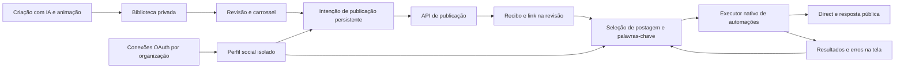

# Instagram: criação, publicação e resposta

A organização vem da sessão validada. Contas e regras são conferidas contra seu perfil antes de qualquer efeito. Um envio incerto é reconciliado por metadado e nunca reenviado automaticamente. O executor social já ativo não depende da imagem dos workers locais. As mutações registram auditoria; a tela fornece o próximo passo quando a plataforma recusa uma operação.
