# Meta própria: login, anúncios e publicações no escreve.ai

Status: **implementação local de OAuth, publicações Instagram e campanhas pausadas; build e QA das telas aprovados. Verificação geral e de banco aprovadas; produção e efeitos reais ainda não comprovados**.
Data da validação: 2026-10-05. Base: `saraivabr/DeskcommCRM`, revisão `34aa784880868fd939bf99a985c6b97f00bae27a`, também confirmada no health de produção.

## Resultado e limite da primeira entrega

O cliente conecta suas contas pelo app da instalação, escolhe os ativos da sua organização e opera anúncios e publicações nas telas do escreve.ai. A autorização acontece na janela oficial da Meta. O cliente não precisa obter nem colar um token de acesso.

Hipótese comercial: reduzir o abandono entre produzir conteúdo/anúncio e iniciar atendimento rastreável. A régua deve separar conexão concluída, publicação confirmada, campanha pausada, campanha veiculada, conversa qualificada e venda. Não atribuir receita a uma conexão ou a um clique. A integração reutiliza a atribuição e o transporte de conversões existentes; não constrói outro CRM.

A primeira entrega cobre Facebook Login for Business, seleção de Página/Instagram profissional associado/conta de anúncios, leitura de resultados, imagem/carrossel/Story Instagram conforme elegibilidade e uma campanha de tráfego com imagem e destino URL. Campanha, conjunto e anúncio começam pausados. A próxima onda cobre publicação em Página do Facebook, Reels e agendamento. Catálogos, Advantage+, públicos avançados, formulários instantâneos e atendimento/DM nativo não são dependências da primeira entrega.

Instagram Login independente é uma extensão do mesmo modelo de conexões: permite publicação profissional sem Página, mas não autoriza anúncios. A primeira entrega usa o login empresarial comum; não se anuncia suporte a conta pessoal ou a funções que a API não oferece.

## O que foi confirmado

| Evidência                                      | Estado observado                                                                                                                                                           |
| ---------------------------------------------- | -------------------------------------------------------------------------------------------------------------------------------------------------------------------------- |
| Painel Meta, app Saraiva.AI `4407041089531183` | App ativo; empresa e acesso como provedora de tecnologia verificados                                                                                                       |
| Marketing API Access Tier                      | Acesso limitado; `ads_management` e `ads_read` aparecem como prontos para teste                                                                                            |
| Instagram Login, análise anterior              | Permissões básicas, mensagens, publicação e comentários reprovadas; feedback pede demonstração completa de login, consentimento e resultado                                |
| Facebook Login for Business                    | Configuração criada `2499860483845536`, token de usuário e sete permissões; callback `https://os.escreve.ai/api/v1/integrations/meta/callback` salvo e validado no console |
| Código publicado na revisão base               | Conexão Facebook/Instagram e publicação Instagram passam pelo Zernio; caminho nativo implementado neste branch, ainda sem deploy                                           |
| Código Meta Ads                                | Token manual com `ads_read`; leitura de contas, campanhas e insights, sem criação/gestão                                                                                   |

Os estados acima são um retrato desta data. Ser provedor verificado, ter app ativo, ter permissão aprovada, ter token válido e funcionar para um cliente externo são provas distintas.

Fontes locais: `lib/channels/social/client.ts`, `app/api/v1/channels/social/route.ts`, `app/app/settings/meta-ads/_form.tsx`, `lib/channels/meta/app.ts`, `app/api/v1/instagram/publish/route.ts` e `docs/escreve-ai.md`.

## Decisões de arquitetura

1. Credenciais do app pertencem à instalação; autorizações e ativos pertencem à organização. Estender o singleton existente `platform_meta_app` com App ID, `business_login_config_id` e habilitação de capacidades. Preservar o segredo e o verify token usados pelo WhatsApp. O resolvedor exige configuração coerente de uma mesma origem; nunca combina App ID do banco com segredo de outra origem.
2. Infraestrutura social Meta em `lib/channels/meta/social/`; transporte Ads em `lib/plataformas-de-anuncio/meta/`. Rotas, componentes e workers usam contratos e capacidades da fronteira, sem HTTP Graph ou decisões de transporte espalhadas nas features. Não adicionar um `ChannelProvider` de atendimento para representar uma conta de anúncios.
3. Conexão, permissão e ativo escolhido são objetos distintos. Cada ação exige configuração habilitada, permissão aprovada para o público pretendido, escopo efetivo do token, tarefa/grant no ativo e código da capacidade implementado.
4. OAuth tem resultado pendente e finalização autenticada. O callback externo não ativa conexão nem vincula ativos sozinho.
5. Toda escrita externa começa com intenção durável e termina com recibo ou próximo passo visível. Timeout após envio é resultado incerto, não autorização para reenviar.
6. Conexões legadas permanecem utilizáveis. Cada operação guarda o provedor escolhido e reconcilia por ele; uma troca de preferência da organização não migra jobs ou repete publicações.

Classificação: evolução do core de integrações sociais/Ads existente, com capacidades opcionais por instalação e organização. Não criar um módulo paralelo nem tabelas dormentes de um módulo no baseline. Se essa classificação mudar, aplicar o provisionamento de módulos definido na ADR 0002 antes de SQL.

Cada tentativa guarda `app_id` e revisão da configuração usados no início; a conexão conserva a identidade do app emissor e a revisão de origem. Alterar o singleton não reinterpreta tokens antigos: o resolvedor exige compatibilidade ou marca reconexão necessária.

O mapa fonte é [meta-native-platform.architecture.json](../architecture/meta-native-platform.architecture.json). Ele descreve a implementação local e as dependências externas; disponibilidade em produção exige a evidência abaixo.

```mermaid
flowchart LR
  UI[Conexões] --> Start[Iniciar com sessão válida]
  Start --> Meta[Autorização oficial Meta]
  Meta --> Pending[Callback: resultado cifrado pendente]
  Pending --> Finalize[Retorno e confirmação da sessão]
  Finalize --> Assets[Seleção de ativos por organização]
  Assets --> Studio[Publicações]
  Assets --> Ads[Campanha em rascunho]
  Studio --> Intent[Intenção durável]
  Ads --> Intent
  Intent --> Worker[Worker com lease e etapas]
  Worker --> Graph[Graph API]
  Graph --> Receipt[Reconciliação e recibo]
  Receipt --> Screens[Resultado ou ação necessária na tela]
```

## Contrato de autorização

O molde de referência é `app/api/v1/agenda/google/{connect,callback}/route.ts`: cookie de vínculo dedicado `HttpOnly`, `Secure`, `SameSite=Lax`, nonce durável e página ponte same-origin. A sessão principal Supabase permanece `SameSite=Strict`.

`supportCallbackWriteAllowed` não revalida membership nem sessão comum. Portanto, copiar apenas a guarda do callback Google é insuficiente para esta integração.

| Etapa proposta                              | Contrato                                                                                                                                                                                                        |
| ------------------------------------------- | --------------------------------------------------------------------------------------------------------------------------------------------------------------------------------------------------------------- |
| `POST /api/v1/integrations/meta/start`      | Admin da organização, Origin/CSRF, guards atuais de MFA e suporte; state opaco aleatório armazenado por hash, vínculo ao navegador, pessoa, organização, sessão e configuração; validade inicial de 10 minutos  |
| `GET /api/v1/integrations/meta/callback`    | Exceção pública apenas neste caminho; verifica vínculo/state/validade e consumo atômico único, troca o código server-side e inspeciona app/sujeito/escopos; guarda resultado cifrado temporário, ainda pendente |
| Retorno ao aplicativo                       | Documento estático com CSP, no-store e no-referrer; destino same-origin fixo; somente ticket opaco, sem token, código ou state na URL seguinte                                                                  |
| `POST /api/v1/integrations/meta/finalize`   | Mesma pessoa, organização e sessão do início; papel/membership atuais, suporte e MFA revalidados; consumo único do ticket e criação/atualização da conexão em seleção pendente na mesma transação               |
| `GET/POST /api/v1/integrations/meta/assets` | Descoberta server-side; seleção usa UUID interno e revalida acesso, tarefas de Página, vínculo Página→Instagram e conta de anúncios                                                                             |
| `GET /api/v1/integrations/meta` e `/health` | DTO sem segredo: estado, ativos selecionados, capacidades e motivo/ação para qualquer bloqueio                                                                                                                  |
| `POST /api/v1/integrations/meta/disconnect` | Invalida uso local e trabalhos pendentes; preserva histórico/recibos; não revoga automaticamente o app globalmente nem pausa campanhas já ativas                                                                |

Os dez minutos são uma proposta técnica inicial, não SLA comercial. Não exigir cadastro de MFA universal novo: cumprir a política e a prova de fatores já usadas pelos guards do repositório.

Toda nova mutação autenticada por cookie verifica Origin/CSRF, incluindo finalização, seleção, desconexão, publicação e comandos Ads de criação/ativação/orçamento. Origin ausente ou divergente é rejeitado conforme a política da API; `SameSite=Strict` não substitui essa verificação. Somente callbacks externos em caminhos exatos usam a exceção apropriada, autenticados pelo vínculo/state ou assinatura da Meta.

Falha na finalização elimina o resultado temporário conforme retenção curta. Logout, troca de sessão/organização ou retirada de papel entre início e retorno impedem ativação. Nunca usar `META_SYSTEM_USER_TOKEN` do WhatsApp como fallback de cliente.

## Modelo de dados proposto

| Objeto                             | Responsabilidade                                                                                                                                                     |
| ---------------------------------- | -------------------------------------------------------------------------------------------------------------------------------------------------------------------- |
| `platform_meta_app` existente      | App ID/configuração empresarial/habilitação; segredo global já cifrado; acesso somente do serviço/admin protegido                                                    |
| `meta_oauth_attempts`              | Hashes de state/vínculo/ticket, ator/org/sessão, finalidade, configuração usada, validade, consumo e resultado temporário cifrado                                    |
| `meta_connections`                 | Autorização por organização/ator/identidade Meta/app; token cifrado, espécie real, escopos, expiração do token e do acesso aos dados, versão de autorização e estado |
| `meta_assets`                      | Identidade interna UUID e unicidade externa por `(organization_id, kind, external_id)`, metadados seguros, Página→Instagram, moeda e fuso de conta                   |
| `meta_asset_grants`                | Relação conexão→ativo, tarefas/grants e token de Página cifrado quando necessário; não mistura autorização com inventário                                            |
| `meta_operations`                  | Intenção imutável, alvo/ator/autorização, hash, chave de idempotência, estado, lease/fencing, etapa, referências externas, recibo e erro seguro                      |
| `meta_campaign_drafts`             | Rascunho/revisão antes da operação; objetivo, destino, mídia, orçamento, moeda e período; IDs executados têm fonte única no recibo/etapas da operação                |
| `instagram_publications` existente | Evolução aditiva: provedor com default legado, referência ao ativo/operação nativa e histórico preservado                                                            |

Aplicar DIRC antes de SQL: não duplicar token em `ad_insights_connections`, escopos em telas ou IDs remotos em duas fontes. Leitura de anúncios resolve a conexão explicitamente escolhida, nativa ou manual legada; expiração da nativa não faz fallback silencioso. `ad_platform_connections`, usado por conversões, conserva seu contrato independente.

A conexão lógica é única por `(organization_id, app_id, local_actor_id, remote_actor_id)`; reautorização atualiza essa conexão e sua versão. FKs compostas usam pais únicos por `(organization_id, id)` e índices nos filhos. Inventário pode reconhecer o mesmo ativo externo em organizações diferentes; somente grants válidos permitem operá-lo.

Todas as tabelas tenant-aware recebem `organization_id` e política RLS canônica. FKs entre elas incluem a organização. Tokens, tokens de Página e tentativas OAuth ficam fora do acesso direto `anon/authenticated`, inclusive ciphertext; API ou projeção segura fornece somente metadados permitidos, nunca resposta Graph bruta. ACL de RPCs novas revoga explicitamente `PUBLIC`, `anon` e `authenticated`, depois concede apenas ao papel necessário; validar também os default privileges do baseline.

Claims/tickets/leases são atômicos no banco, com fencing contra worker atrasado. Todas as condições de ator/org/sessão/validade entram no claim; consumo do ticket e ativação local não podem ficar em transações separadas. HTTP Meta acontece fora da transação. Resultados temporários de tentativas vencidas ou falhas são eliminados conforme retenção curta.

Escritas externas exigem reserva durável que falha fechada. Não reaproveitar `comIdempotencia` como barreira de efeito: hoje ele permite prosseguir quando a reserva falha e seu prazo de 60 segundos permite nova tentativa. A chave única por org/tipo/intenção e o hash imutável permanecem vinculados ao recibo; expiração de cache nunca autoriza repetir um efeito. A mesma chave com alvo/conteúdo/orçamento diferente retorna 409.

O schema sai em migration versionada, baseline idempotente, MANIFEST e tipos gerados; reservar numeração apenas quando começar a implementação, verificando colisões na main e PRs em voo.

## Operações e UX

Estados de conexão: desconectada → OAuth pendente → seleção pendente → conectada; também reconexão necessária, permissão insuficiente e revogada. Cada capacidade tem disponibilidade e motivo; nunca apresentar um único “tudo conectado”.

Estados de operação: fila → processamento → aguardando provedor → sucesso, falha, incerta ou bloqueada. Falha permanente orienta a pessoa; bloqueio por acesso exige reconectar/reautorizar; resultado incerto permite conciliar. Não existe botão que apenas repita um POST externo desconhecido.

`event_log` continua sendo a entrada de execução; `meta_operations` registra execução/etapas/recibo; `instagram_publications` conserva intenção e resultado exibido. Transições relacionadas são atômicas ou a tela deriva o estado da operação, evitando dois estados divergentes.

O claim do worker usa `SKIP LOCKED`, condição de elegibilidade repetida no UPDATE, lease, fencing e `retry_at`; heartbeat e conclusão exigem o fence corrente. Worker verifica conexão/versão/grants atuais na execução, sem perpetuar a autoridade de uma sessão de suporte encerrada. Lease vencido após início de HTTP externo leva a incerto/conciliação. Fencing protege o banco, mas não cancela um efeito já enviado à Meta. Cada estágio salva o ID remoto antes de avançar. Graph usa hosts fixos, bearer em header, redirects recusados, paginação validada e limites de timeout/páginas. Não presumir refresh token, token perpétuo ou idempotência genérica da Meta.

**Publicações:** evoluir o alvo discriminado por provedor, preservando `account_id` hexadecimal do Zernio. Meta usa UUID interno de ativo, não um ID remoto livre. Reutilizar preparação de imagens privadas, histórico e reconciliação existentes; a barreira de idempotência da escrita Meta segue o contrato durável acima. Default legado e CHECKs mantêm provedor/alvo/operação consistentes. Container/processamento não significa publicação: aceite exige ID publicado, permalink quando disponível e leitura/presença no ativo escolhido. Provedor salvo na intenção governa toda reconciliação.

**Anúncios:** rascunho → revisão → criação de campanha/conjunto/criativo/anúncio pausados → leitura dos IDs e estados → ativação explícita. Revisão aprovada tem hash imutável; cada etapa mantém checkpoint de IDs remotos. Orçamento usa campos tipados inteiros em unidades mínimas, moeda/fuso lidos da conta, limite validado e transação contra concorrência. Ativação e aumento de gasto são ações distintas, com conta, valor, período e revisão visíveis; nunca efeito automático de conectar ou criar. Página/destino/criativo passam pela validação de grants observados e sua atualidade.

Portas existentes: `/app/connections`, `/app/instagram`, `/app/ads/meta` e `/app/settings/meta-ads`. Configuração do app é extensão de `/admin/meta`. Registrar na navegação somente uma tela nova indispensável. A interface mostra cancelamento, nenhum ativo, consentimento parcial, expiração, acesso limitado e resultado incerto com próximo passo concreto.

Desautorização e exclusão têm callbacks próprios com `signed_request` validado, contexto do app e deduplicação. Desativam autorizações/filas correspondentes, eliminam dados derivados conforme política e oferecem status de solicitação opaco. Não removem indiscriminadamente dados CRM não relacionados. A confirmação da espécie/formato de callback e política final da Meta é gate antes de implementar.

## Plano e dependências

| Marco | Entrega                                                    | Depende de                     | Evidência para avançar                                                                                |
| ----- | ---------------------------------------------------------- | ------------------------------ | ----------------------------------------------------------------------------------------------------- |
| M0    | Contratos, planta, escopo e revisão de segurança/banco     | Auditoria atual                | Spec consistente, donos exclusivos e gates explícitos; conclusão deste pedido                         |
| M1    | Configuração do app, OAuth, finalização, ativos e Conexões | M0                             | Sessão preservada, guards negativos, isolamento de duas organizações e conexão real em conta elegível |
| M2    | Leitura de anúncios pela conexão própria                   | M1                             | Conta/campanhas/resultados conferidos contra Meta; cliente sem token manual                           |
| M3A   | Publicação Instagram pelo Studio                           | M1                             | Publicação autorizada em conta de teste, ID/resultado no ativo escolhido, legado preservado           |
| M3B   | Rascunho e criação/gestão de campanha pausada              | M2                             | Todos os objetos lidos de volta em PAUSED, orçamento/IDs corretos, falhas parciais reconciliadas      |
| M4    | Pacote de App Review e acesso Marketing API                | M1 + M3A + M3B demonstráveis   | Login→consentimento→ativos→ação→resultado em vídeo real; decisão do provedor registrada               |
| M5    | Piloto externo e rollout das capacidades aprovadas         | M4 + checks de código/banco/UX | Cliente sem papel de admin/tester do app, recibos reais e UI/health no SHA publicado                  |
| M6    | Facebook Pages, Reels, agendamento e login IG independente | Base M1 + gates específicos    | Cada capacidade testada e aprovada individualmente, reutilizando autorização/recibos                  |

M3A e M3B são paralelos. M4 pode ser preparado antes de todas as aprovações; funcionamento de testador não encerra M5. Não prometer prazo de App Review nem datas de release sem dados.

## Orquestração e ownership

A elaboração foi dividida entre agentes de arquitetura de código, planejamento de entrega, segurança e revisão de banco; a raiz consolida decisões e resolve divergências. A fila abaixo é para implementação futura, não relato de tarefas de código já despachadas.

| Frente           | Arquivos/responsabilidade exclusivos                                                                                                                                                                           | Saída obrigatória                                                             |
| ---------------- | -------------------------------------------------------------------------------------------------------------------------------------------------------------------------------------------------------------- | ----------------------------------------------------------------------------- |
| Plataforma/OAuth | `lib/channels/meta/social/` núcleo, `app/api/v1/integrations/meta/`, callbacks assinados, migrations/baseline/MANIFEST/tipos                                                                                   | APIs de conexão/ativos/operações + testes de autorização/RLS/claims           |
| Conexões/front   | `components/connections/` integração Meta, estados e seleção                                                                                                                                                   | UI sobre API real + jornada de início/cancelamento/finalização/expiração      |
| Publicações      | Adapters de publicação explicitamente delegados, `lib/instagram/publication-schema.ts`, rota publish e Studio                                                                                                  | Mesmo front para destinos validados + recibo/reconciliação + regressão Zernio |
| Ads              | `lib/plataformas-de-anuncio/meta/`, resolvedor de leitura, `app/api/v1/ads/meta/`, compositor/tela Ads                                                                                                         | Rascunho/revisão, estágios pausados, gestão e leitura posterior               |
| Orquestrador     | Integração admin/env/public paths, implementação exclusiva de `workers/meta-operation-worker.ts` e `workers/meta-operation-worker.handler.ts`, registro do consumidor/deploy, decisões compartilhadas e aceite | Contratos congelados, integração por marco e evidências verificadas           |
| QA/revisão       | Casos de teste/evidências; review TypeScript, segurança e banco nos respectivos diffs                                                                                                                          | Achados resolvidos; limites da prova declarados                               |

Limite operacional: raiz + até três agentes simultâneos. Onda 1: Plataforma + Conexões + QA/revisão. Onda 2: Publicações + Ads + QA/revisão. Revisor de banco/segurança substitui uma vaga; não abrir quatro implementadores junto com a raiz.

Antes de despachar, cada pacote recebe objetivo, arquivos exatos, interfaces, restrições, teste/evidência e retorno estruturado. Todos preservam edições concorrentes. Arquivo compartilhado tem um único dono; alteração de contrato volta à raiz e invalida consumidores/reviews afetados. Plataforma delega explicitamente seus arquivos de adapter de publicação após congelar as interfaces, sem dois escritores no mesmo módulo.

Retorno de cada agente: alterações e paths, verificações executadas com exit code, evidência reproduzível, lacunas/gates e próximo passo. Relato do agente não substitui inspeção do diff e teste/UX pelo orquestrador. Estado de cada pacote: aguardando dependência, executando, em revisão, corrigindo ou aceito.

## Validação e liberação

- OAuth e mutações: Origin ausente/divergente, state ausente/alterado/repetido/expirado, outro navegador, callbacks concorrentes, logout/troca de sessão/org, retirada de membership/papel, suporte restrito/expirado e fatores MFA sem prova; exceções limitadas aos callbacks externos autenticados.
- Autorização: consentimento parcial, token de outro app/sujeito, tarefas insuficientes, ativo de outra organização, token revogado/vencido e grants retirados durante fila.
- Persistência: ACL de segredos e RPCs, FKs compostas e tentativa de vínculo entre orgs, mesmo ativo externo em duas organizações, ticket/lease concorrentes, worker com fence antigo, reautorização sem duplicação e migration fresh/update sob default ACL Supabase.
- Efeitos: duplo clique, worker atrasado, timeout após cada estágio, mesma chave com payload diferente, falha parcial de campanha, processamento IG e revogação na execução.
- Front: começo sem configuração opcional, cancelamento, seleção, reconexão, revisão/recibo e regressão de conexões/publicações Zernio. Fixtures provam contrato, não login/publicação reais.
- Por marco de código: typecheck, lint, lint de canais e testes pertinentes. Antes de PR funcional: suíte exigida pelo repo, banco real quando schema/RBAC, E2E com baseline fresco/update e evidência visual. Revisões TypeScript, segurança e banco acompanham os diffs respectivos.

Pacote Meta: ambiente acessível, conta de revisão restrita, instruções reproduzíveis, demonstração contínua de login/consentimento/ativos/ação/resultado para cada permissão, privacidade e exclusão funcionais. Reconfirmar no console os nomes e dependências dos scopes da modalidade escolhida; não usar vídeo Zernio como demonstração da API própria.

**Produção do vídeo em M4:** usar Computador para conduzir a jornada real e a captura da tela, Remotion para montagem e anotações, e ElevenLabs para narração sincronizada. Preservar a gravação original e o projeto editável; a edição mantém visíveis todos os passos de login, consentimento, seleção, ação e resultado. O roteiro descreve somente o comportamento gravado. Não fabricar telas ou resultados para substituir a implementação. Revisar imagem/áudio, legibilidade, sincronização e dados expostos antes da entrega; submissão à Meta é uma ação separada.

Prontidão verificada em 2026-10-05: Remotion/ffmpeg disponíveis; captura de tela pelo Computador comprovada nas configurações Meta. Chave ElevenLabs dedicada restrita a TTS/vozes/modelos, 20.000 créditos e sete dias, com acesso a modelos/vozes confirmado e demais dados da conta negados. Em 2026-10-06, a narração de abertura foi gerada pela API ElevenLabs (MP3 de 24,75 s). O screencast da jornada e a montagem final ainda não foram produzidos. Nenhuma credencial está neste repositório.

Rollout: capacidades da instalação desligadas por padrão → organização técnica elegível → piloto externo → expansão. Publicação e Ads têm habilitação independente. Rollback desliga novos caminhos e preserva registros; não reenvia operação por outro provedor nem apaga recibos/IDs. Desconectar não promete apagar publicações ou pausar anúncios na Meta.

**Gate de deploy concreto:** a rotina IRB neste branch extrai 0415/0416 e contrato Meta da imagem worker da mesma revisão/digest. Rejeita schema parcial, dependências ausentes ou ACL/RLS incompatíveis antes de parar serviços; drena worker, aplica somente schema ausente em transação e preserva funções compatíveis já instaladas. Fixtures do deploy passaram 31 casos. Script revisado instalado no servidor em 2026-10-06, com hash conferido e cópia anterior preservada; aplicação real da 0416 ainda pendente. Entrega em produção exige CI da revisão, schema compatível, health/SHA, front autenticado e resultado externo aplicável.

A execução/configuração/deploy e vídeo foram autorizados pelo usuário. A criação da credencial ElevenLabs recebeu confirmação específica. OAuth que amplia acesso exige o consentimento na tela oficial da Meta. Não há autorização para ativar anúncios ou gastar orçamento: esta entrega cria a hierarquia pausada. App Review externo ainda depende da decisão da Meta.

Evidência local atualizada em 2026-10-06: build completo aprovado e E2E de Conexões/Ads passou 2/2, sem retries, com autenticação e organização locais reais, Meta dublada, desktop e mobile de 390 px. Revisão TypeScript sem novos defeitos; `pnpm gov:verify` aprovado, com typecheck, lint sem erros, limites de arquitetura e 14.413 testes aprovados (uma falha esperada já declarada pela suíte). A árvore final passou 24/24 invariantes Meta em PostgreSQL 15 e 17, instalação/reaplicação do baseline e atualização com dados nas duas versões, preservando dez linhas, oito objetos/OIDs e a view. O guard verifica 117 colunas, ACLs, relações e índice de manutenção; rejeita schema parcial e aceita extensões compatíveis. Revisão geral e de banco encerradas sem achados pendentes. Duas falhas remanescentes na suíte ampla de banco foram diagnosticadas como preexistentes: favorito pessoal classificado pelo inventário RBAC e comparação do relógio VM/host. Contratos dublados não comprovam consentimento, publicação ou anúncio real.

## Checklist de conectividade da arquitetura

| Pergunta               | Artefato/contrato proposto                                                                                                               |
| ---------------------- | ---------------------------------------------------------------------------------------------------------------------------------------- |
| Entrada e saída        | Conexões → grants/ativos → Studio/Ads → operação → resultado na tela                                                                     |
| Registro e observação  | `event_log`, `api_audit_log`, recibo e histórico de publicação/campanha; projeção sanitizada na UI                                       |
| Porta e configuração   | Conexões/Studio/Ads existentes; app e capacidades em `/admin/meta`                                                                       |
| Próximo passo          | Reconectar/reautorizar para bloqueio; conciliar para incerto; corrigir rascunho para erro permanente                                     |
| Continuidade humano/IA | Pessoa confirma publicação/ativação; futuro uso por agente exige o mesmo contrato de intenção/revisão, sem conceder autoridade adicional |
| Laço de retorno        | Revogação remove capacidade e bloqueia fila; recibo encerra intenção; erro incerto muda ação para conciliação, sem repetir efeito        |
| Mapa                   | Planta JSON ligada a esta spec; cada peça central tem entrada e saída                                                                    |

## Referências da Meta

- [Facebook Login for Business](https://developers.facebook.com/docs/facebook-login/facebook-login-for-business/) — App ID/configuração e autorização empresarial.
- [Access Verification](https://developers.facebook.com/docs/development/release/access-verification/) — verificação de provedor separada de análise das permissões.
- [Marketing API authorization](https://developers.facebook.com/docs/marketing-api/overview/authorization/) — níveis de acesso e permissões de anúncios.
- [Instagram publishing](https://developers.facebook.com/docs/instagram-platform/content-publishing/) — capacidade de publicação e elegibilidade.
- [Instagram Login](https://developers.facebook.com/docs/instagram-platform/instagram-api-with-instagram-login/) — modalidade independente, sem autorização Ads.
- [Page posts](https://developers.facebook.com/docs/pages-api/posts/) — publicação de Página.
- [Feedback observado da nossa análise](https://developers.facebook.com/apps/4407041089531183/app-review/submissions/feedback/?submission_id=4410034945898464) — demonstração incompleta do caso de uso.

As referências são dependências a conferir novamente em M1/M4; a condição do nosso app foi observada no console nesta data, e nenhum número de chamada, prazo ou permissão futura é tratado como aprovação recebida.
