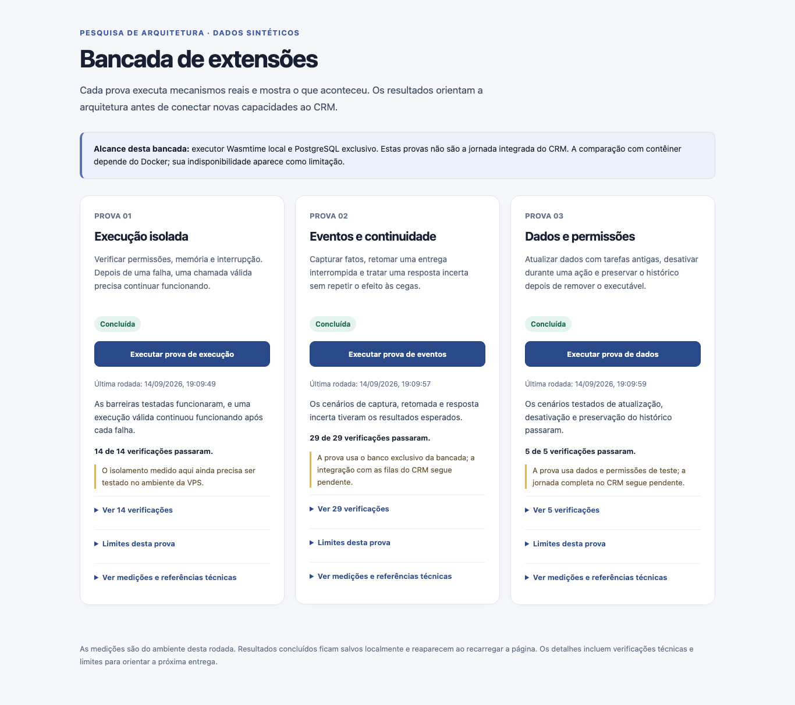
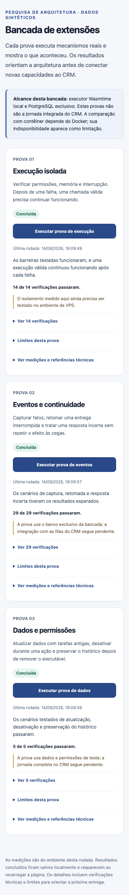
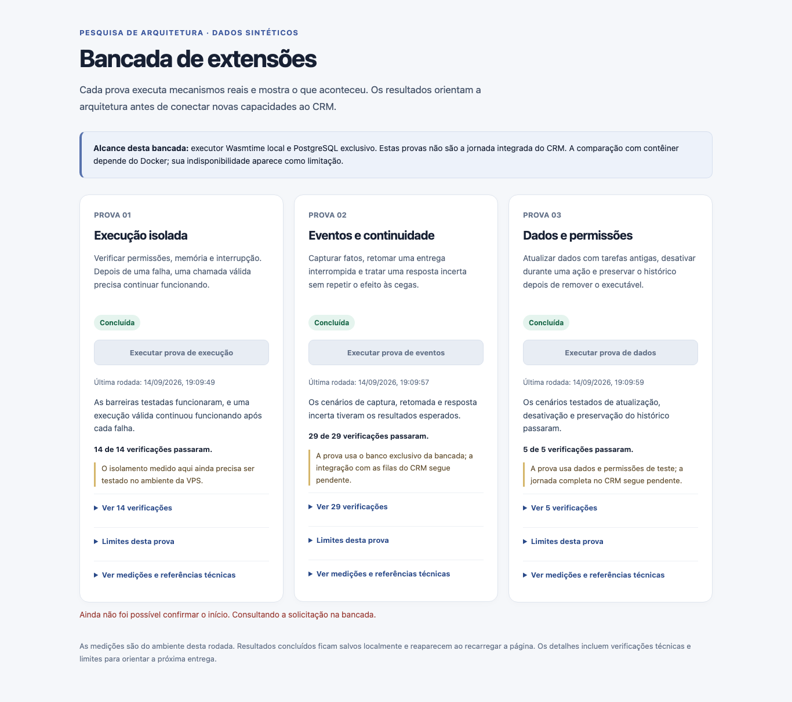

# Evidência visual da bancada de extensões

Capturas de 14/set/2026, somente dados sintéticos. Extraídas da rodada final de cinco jornadas Playwright em Chromium e inspecionadas pelo agente principal. São provas da interface experimental; não mostram um marketplace ou a jornada de extensões integrada ao CRM.

O navegador iniciou as três provas reais, comparou o resultado exibido com o backend e o arquivo persistido, recarregou a tela e percorreu ambiente ausente, perda de conexão e resposta perdida depois do aceite. A revisão adicional conferiu os controles do processo e a reconciliação da solicitação. Resultados, limites e próximos passos no PROG-020 *(documento interno de decisão)*.

## Três resultados reais na tela

Os detalhes ficam recolhidos, o resultado principal é legível e os limites de cada prova estão visíveis. O aviso superior identifica o alcance experimental.

## Tela estreita

A inspeção não encontrou corte horizontal, botões ocultos ou texto sobreposto nesta captura. A navegação por teclado foi exercitada pelo navegador.

## Início aceito, resposta perdida

A captura mostra o intervalo em que o backend já aceitou a solicitação e a tela ainda busca o recibo. Os resultados anteriores continuam identificados pela hora da rodada; os botões ficam indisponíveis enquanto a nova solicitação é reconciliada. O teste liberou a consulta e confirmou a chegada do resultado real, a retirada do aviso e o reenvio idempotente.
